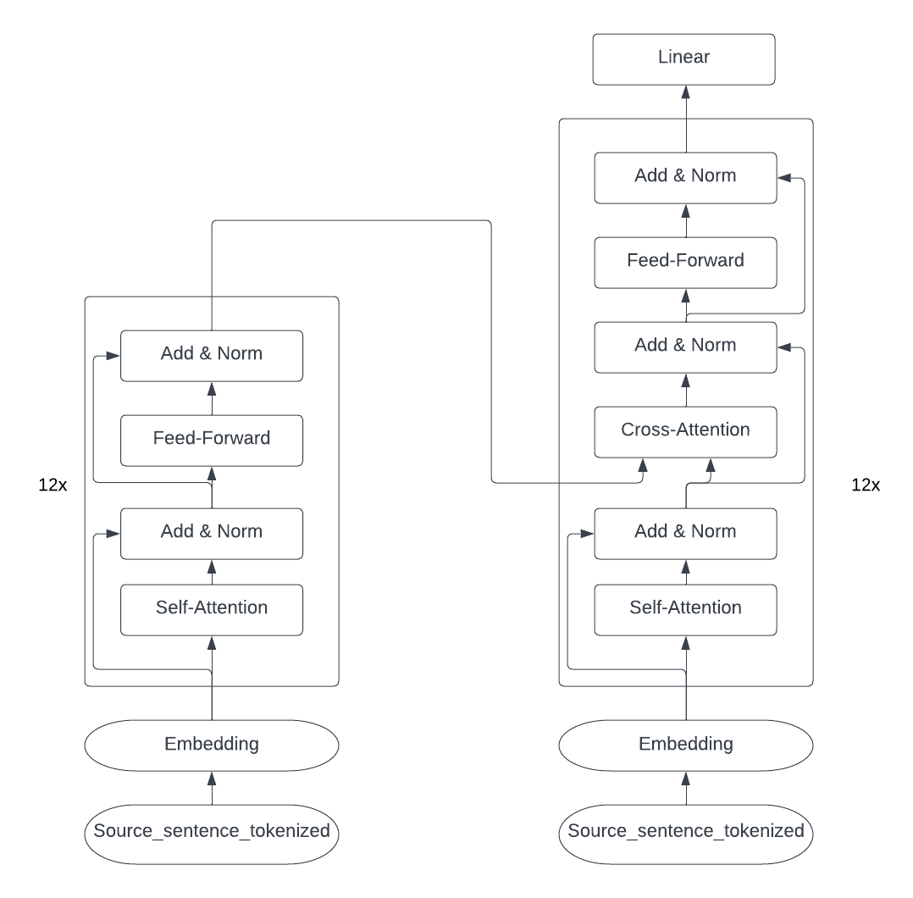
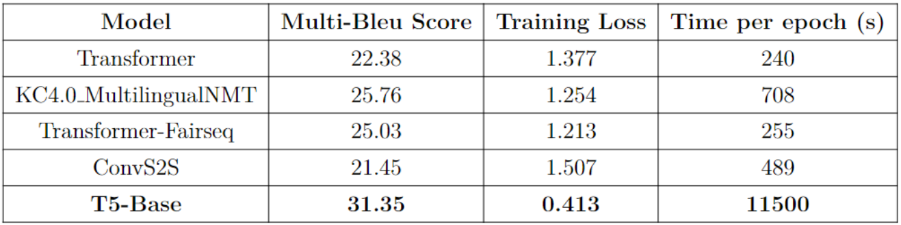

# Neural Translate Machine

Neural Translate Machine is an open-source project aimed at providing English-to-Vietnamese translation using state-of-the-art neural network models. It leverages the T5 model as the main contributor, along with three Transformer-based models and ConvS2S as a baseline.

## Features

- English-to-Vietnamese translation
- Multiple neural network models, including T5, Transformer, and ConvS2S
- Training on the iwlst dataset
- Open-source project for contributions and further development

## T5 Architecture

The T5 model, short for "Text-to-Text Transfer Transformer," is a versatile and powerful neural network architecture for natural language processing tasks. It employs a transformer-based architecture with 12 encoder-decoder layers, attention mechanisms, and positional encodings. T5 is pre-trained on a massive amount of text data and can be fine-tuned for specific downstream tasks like translation.

## Usage

To run the T5 model, please refer to the `Transformer.ipynb` notebook available on Kaggle. For the Transformer-FairSeq and ConvS2S models, please use Google Colab.

## Performance

The T5 model achieves a Multi bleu score of 31.5 for English-to-Vietnamese translation.

## Installation

No specific dependencies or prerequisites are required for running the provided models.

## Contribution

Contributions to this project are welcome. You can contribute by continuing training on other datasets, improving the existing models, or adding new features to enhance translation accuracy and performance.

## Contact

For any inquiries or feedback, please reach out to us via email at trinhtan339@gmail.com.

## License

This project is released under an open-source license.
